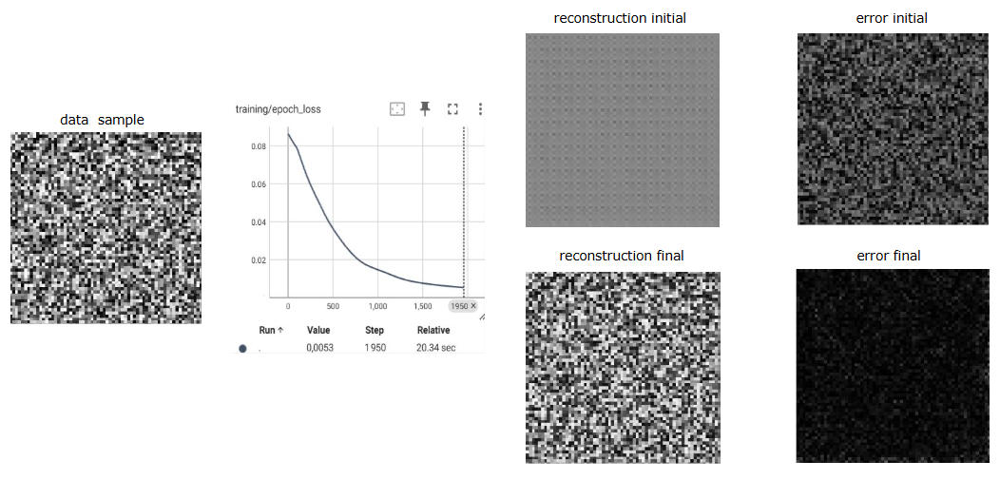

# Deep Learning Project Template
A lightweight template for **PyTorch** based deep learning projects with main features of configuration management (**Hydra**), 
logging (**Loguru**+**TensorBoard**), and 
hardware-agnostic training (**Lightning Fiber**). Designed for rapid experimentation while enforcing best practices.

# Why another one?
There exist many templates already. Why this? I've worked as a research engineer in computer vision for 4 years and
my usual workflow is to do literature review on sota for the given topic, implement them or use their codebase to make it
work/adjust it on a specific company/lab data/problem. Some codebases are good, some are bad. But with no one standard,
it takes a lot of energy to understand the codeflow to be able to use it. What I mainly want is the dataset processing,
the model, the loss and the training logic. Rest its easier to work with something that is more familiar to me for experiments.
SO usually I end up rewriting their implementation stripping it down to minimum. What then is a repetitive flow to implement 
is having nice config management for parameters for different experiments, having nice (free) logging for tracking,
and smooth multi gpu runs at times. For the model, data, training logic, these can be plugged in easily.


### **But we already have other nice templates?**
I checked them all. They are scary to modify. Overkill so to speak, atleast for me. I'm like I have my model, data, training logic,
give me the rest. But the rest tends to be too much, difficult to adapt. Killing the earlier mentioned point of energy requirement
to adapt. What I mainly need again and again is:
1. I will have one or several models and training settings. I want to run different experiments and track them 
to see whats working and whats not and adapt. I will want to run inference using those settings easily. I want to switch settings fast and easy.
2. I want to see whats happening during training to get a feel early on whats going on. I want good logging (for free).
3. I dont want to cuda this cpu that, use a different accelerator/hardware/precision

### **Previously**
- You have lightning templates which is too much abstraction == less flexibility without the learning curve for lightning for me 
- You have templates but they are heavy and come with their own learning curve so to speak.

### **So here you get**
- **Configuration Management**: Hierarchical configuration using Hydra
- **Experiment Tracking**: Automatic saving and loading of experiment configurations
- **Logging**: Comprehensive logging to both console and files using Loguru
- **Visualization**: TensorBoard integration for metrics, images, and model graphs
- **Hardware Agnostic**: We use Lightning Fiber >> Pytorch lightning when it comes to tradeoff of boilerplate vs adaptability
- **Lean Structure**: For quick start and adaptability

# How to use
USe this mainly for the config management and logging features. A toy example of a reconstruction autoencoder for a random image
to show it works and show where the dataset, model, loss optimizers, training/validation/inference logic, vis, io, other utils could go.
You're in control.

## Project Structure
```
├── configs/                # Configuration files
│   ├── config.yaml         # Main configuration
│   ├── data/               # Dataset configurations
│   ├── experiment/         # Experiment configurations
│   ├── model/              # Model configurations
│   └── training/           # Training configurations
├── model_save/             # Saved models and experiment data
├── src/                    # Source code
│   ├── data/               # Dataset implementations
│   ├── model/              # Model implementations
│   ├── utils/              # Utility functions
│   │   ├── logging/        # Logging utilities
│   │   │   ├── msg_logger.py  # Message logging with Loguru
│   │   │   └── tb_logger.py   # TensorBoard logging
│   │   ├── io.py          # I/O utilities
│   │   ├── utils.py       # General utilities
│   │   └── visualization.py # Visualization utilities
│   ├── infer.py           # Inference script
│   └── train.py           # Training script
└── requirements.txt        # Dependencies
```

## Getting Started

### Environment Setup

Set up your own environment, but to you need atleast mentioned in the provided `requirements.txt` file to use the features here and
run the toy example (adapt the cuda version or just use your own installation proc):

```bash
conda create -n minimal python=3.10
conda activate minimal
pip install --force-reinstall -r requirements.txt
```

## Usage
### 1. Training a Model

To train a model with the default configuration:

```bash
python src/train.py
```

This will:
1. Create an experiment directory in `model_save/` with the experiment name `<exp_name>`
2. Save the configuration used for training in `model_save/<exp_name>/.hydra` (for reference and used for resuming exp or inference)
3. Log messages to both console and a log file `model_save/<exp_name>/train.log` in the experiment directory 
4. Log metrics and visualizations to TensorBoard in `model_save/<exp_name>/tb`

**Key CLI Overrides**:
You can override any configuration parameter from the command line:
```bash
# Change run params 
python src/train.py experiment.exp_name=my_experiment training.epochs=100 training.batch_size=64

# Change model architecture
python src/train.py model=complex

# Multi-GPU training
python src/train.py training.devices=2 training.accelerator="gpu"

# Mixed precision
python src/train.py training.precision="16-mixed"
```

### 2. Inference
```bash
python src/infer.py --experiment <exp_name>
```
- Loads config from original training run
- Saves predictions to `model_save/<exp_name>/preds`

Optionally, you can also use CLI to over-ride params during inference (needed sometimes)
```bash
python src/infer.py --experiment <exp_name> data.image_type=tif
```

## Configuration Management

### Core Concepts
1. **Hierarchical Configs**  
   Compose configurations from multiple files:
   ```yaml
   # configs/config.yaml
   defaults:
     - experiment: default
     - training: default
     - model: base
     - data: default
   ```

2. **Experiment-Specific Settings**  
   ```yaml
   # configs/experiment/default.yaml
   exp_name: "unet_baseline"
   description: "Base UNet with MSE loss"
   ```

3. **Model Zoo**  
   Switch architectures via config:
   ```yaml
   # configs/model/unet.yaml
   _target_: src.model.unet.UNet
   in_channels: 1
   out_channels: 1
   initial_features: 64
   ```

### Creating New Configurations

To create a new configuration, add a YAML file to the appropriate directory:

1. For a new model: `configs/model/my_model.yaml`
2. For a new dataset: `configs/data/my_dataset.yaml`
3. For a new training setup: `configs/training/my_training.yaml`

Then update the default yaml
   ```yaml
   # configs/config.yaml
   defaults:
     - experiment: my_experiment
     - training: my_training
     - model: my_model
     - data: my_dataset
   ```

OR use it from CLI with:
```bash
python src/train.py model=my_model data=my_dataset training=my_training experiment=my_experiment
```

## Logging and Visualization

### Message Logging

The template uses Loguru for message logging. The flow is simple. Look at `src/train.py`. Here is a snippet, in your
entry point:
```python
import hydra
from src.utils.logging.msg_logger import setup_logging
# Set up msg logger
hydra_cfg = hydra.core.hydra_config.HydraConfig.get()
setup_logging(exp_dir=hydra_cfg.run.dir, log_filename=hydra_cfg.job.name)
```
Then in any file/module/function/class, do 
```python
from loguru import logger
epoch=0
loss=1
logger.info(f"Epoch {epoch} loss: {loss:.4f}")
logger.info("Starting training process")
logger.warning("GPU memory is running low")
logger.error("Failed to load dataset")
something = `something`
logger.opt(colors=True).info("<blue>Using color to highlight(s):</blue> <green>{}</green>", something)
```
Logs are saved to both the console and a log file in the experiment directory.

### TensorBoard Logging

The template includes a TensorBoard logger for visualizing metrics and images:

```python
from src.utils.logging.tb_logger import TensorBoardLogger
tb_logger = TensorBoardLogger(tb_dir)

# Log a scalar value
tb_logger.log_scalar("training/loss", loss_value, step)

# Log images
tb_logger.log_images("training/generated_images", sample_images, step)

# Log model graph
tb_logger.log_model_graph(model, dummy_input)
```

To view TensorBoard logs:

```bash
tensorboard --logdir model_save/my_experiment/tb
```

## Example Task: Image Reconstruction

**Implemented Components**:
- UNet architecture with configurable depth/features
- Random image dataset (template for easy replacement)
- MSE loss autoencoder training
- Reconstruction visualization utilities



## Extending the Template

This template is designed to be extended for your specific needs:

### 1. Add New Models
1. Implement model in `src/model/`
2. Create config in `configs/model/`
3. Update main config:
   ```yaml
   defaults:
     - model: your_model  # in configs/config.yaml
   ```

### 2. Add Datasets
1. Implement dataset class in `src/data/`
2. Update data config:
   ```yaml
   # configs/data/default.yaml
   data:
     name: "your_dataset"
     image_size: 256
   ```

### 3. Modify Training Logic
1. Edit `src/train.py` core loop
2. Add new metrics/visualizations
3. Extend logging as needed

### 4. Add custom metrics and visualizations using the TensorBoard logger

## Again

- Make use of the core features of config management and logging for deep learning exps
- Look at the lightweight toy example for what the workflow could be
- Easy (relatively easy/easier) to open it and adapt for your use case (hopefully)

## License
```
MIT License

Copyright (c) 2021 ashleve

Permission is hereby granted, free of charge, to any person obtaining a copy
of this software and associated documentation files (the "Software"), to deal
in the Software without restriction, including without limitation the rights
to use, copy, modify, merge, publish, distribute, sublicense, and/or sell
copies of the Software, and to permit persons to whom the Software is
furnished to do so, subject to the following conditions:

The above copyright notice and this permission notice shall be included in all
copies or substantial portions of the Software.

THE SOFTWARE IS PROVIDED "AS IS", WITHOUT WARRANTY OF ANY KIND, EXPRESS OR
IMPLIED, INCLUDING BUT NOT LIMITED TO THE WARRANTIES OF MERCHANTABILITY,
FITNESS FOR A PARTICULAR PURPOSE AND NONINFRINGEMENT. IN NO EVENT SHALL THE
AUTHORS OR COPYRIGHT HOLDERS BE LIABLE FOR ANY CLAIM, DAMAGES OR OTHER
LIABILITY, WHETHER IN AN ACTION OF CONTRACT, TORT OR OTHERWISE, ARISING FROM,
OUT OF OR IN CONNECTION WITH THE SOFTWARE OR THE USE OR OTHER DEALINGS IN THE
SOFTWARE.
```